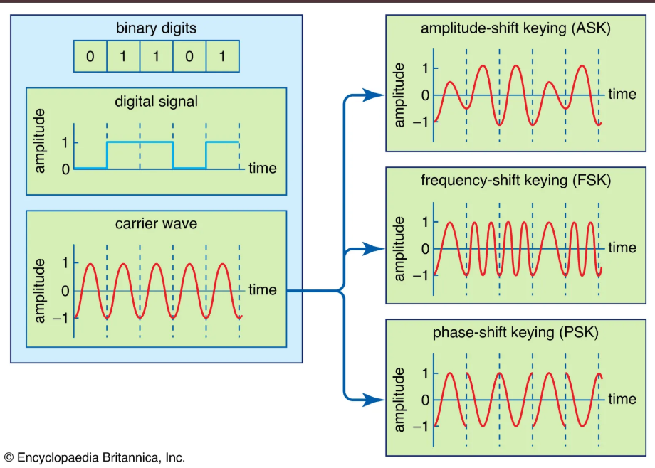
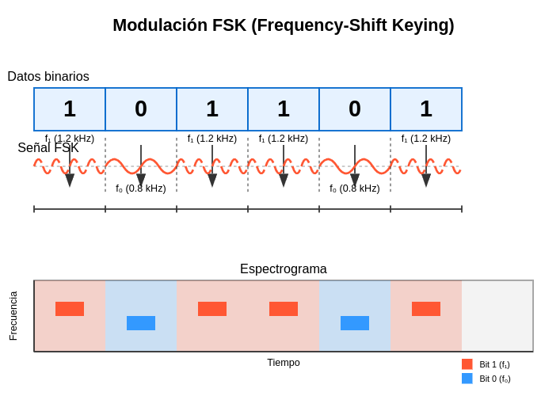
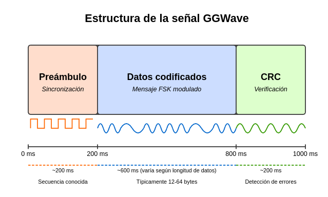

# GGWave: Transmisión de datos mediante ondas sonoras
---

## 1. Introducción a GGWave

### ¿Qué es GGWave?
- Biblioteca de código abierto para la transmisión de datos a través de ondas sonoras
- Desarrollada por Georgi Gerganov (de ahí el nombre "GG")
- Software multiplataforma disponible para múltiples lenguajes de programación
- Repositorio principal: [github.com/ggerganov/ggwave](https://github.com/ggerganov/ggwave)

### Características principales
- Codifica datos digitales en patrones acústicos.
- Funciona en rangos audibles e inaudibles (ultrasónicos).
- Transmisión sin requerir conectividad de red (WiFi, Bluetooth, etc.).
- Ideal para transferencia de pequeños paquetes de datos.
- Implementación ligera y eficiente.

---

## 2. Fundamentos teóricos

### Principios de funcionamiento
- **Codificación de datos**: Conversión de bits a ondas sonoras
- **Modulación**: Utiliza principalmente FSK (Frequency-Shift Keying)

### Técnicas de modulación en GGWave
#### FSK (Frequency-Shift Keying)

**Principio básico**

La FSK representa los datos binarios (0s y 1s) mediante dos frecuencias diferentes:

Para el bit '1', se usa una frecuencia más alta (f₁, aproximadamente 1.2 kHz en GGWave)
Para el bit '0', se usa una frecuencia más baja (f₀, aproximadamente 0.8 kHz en GGWave)

Cada bit del mensaje original (secuencia 101101) se asigna a una de las dos frecuencias
Durante el intervalo de tiempo correspondiente a cada bit, la señal transmitida oscila a la frecuencia asignada
La transición entre frecuencias ocurre al cambiar de un bit a otro

  - Cambios discretos en la frecuencia para representar datos binarios.
  - Resistente a distorsiones de fase y amplitud. 
  - Al basarse en frecuencias y no en amplitudes, es menos susceptible a interferencias ambientales

### Estructura de la señal GGWave

* **Preámbulo (200 ms aproximadamente)**: Sincronización entre emisor y receptor. Es una secuencia conocida y predecible que permite al receptor identificar el inicio de la transmisión. Se representa mediante una onda cuadrada con patrón regular. Funciona como "despertador" para el receptor, permitiéndole ajustar sus parámetros de escucha.

* **Datos Codificados (600 ms aproximadamente, variable)**: Contiene el mensaje real a transmitir, modulado con FSK (Frequency-Shift Keying). La duración varía según la longitud del mensaje (típicamente entre 12 y 64 bytes). Representa el payload o carga útil de la comunicación

* **CRC (Cyclic Redundancy Check) (200 ms aproximadamente)**: Verificación de la integridad de los datos. Contiene una suma de comprobación calculada a partir de los datos enviados. Permite al receptor detectar errores en la transmisión, también utiliza modulación FSK pero con características específicas. Ayuda a determinar si los datos se recibieron correctamente

> La duración total de una transmisión GGWave típica es de aproximadamente 1 segundo.

---

## 3. Aplicaciones prácticas

### Casos de uso actuales
- "QR codes" sonoros: transmisión de URLs o datos cortos.
- Comunicación entre dispositivos sin conectividad estándar.
- Sistemas de autenticación acústica. Similar a los tokens OTP (One-Time Password) pero transmitidos por sonido.
- Transferencia de datos en entornos con restricciones electromagnéticas.
- Sistemas de control remoto mediante audio.
- Sistemas de pago.

### Ventajas y limitaciones

#### Ventajas:
- No requiere hardware especializado (solo altavoz y micrófono).
- Funciona a través de medios físicos (aire, agua, materiales sólidos).
- Independiente de la conectividad de red.
- Muy bajo consumo energético.

#### Limitaciones:
- Tasa de transferencia relativamente baja (típicamente < 100 bps).
- Sensible a ruido ambiental.
- Distancia limitada de transmisión.
- Potenciales molestias acústicas en rangos audibles.

---

## 4. Demostración en vivo

### Preparación
- Script de Python utilizando la biblioteca GGWave
- Dos dispositivos: uno como emisor, otro como receptor
- Mensaje simple a transmitir: "Hola clase de Señales y Sistemas"

### Implementación paso a paso
1. **Codificación del mensaje**
   - Conversión de texto a bits
   - Aplicación de la modulación FSK
   - Generación de la forma de onda

2. **Reproducción de la señal**
   - Emisión mediante altavoz
   - Visualización del espectrograma en tiempo real

3. **Recepción y decodificación**
   - Captura mediante micrófono
   - Procesamiento de la señal
   - Decodificación y visualización del mensaje recuperado

### Análisis de la demostración
- Discusión sobre el espectrograma observado
- Identificación de componentes de la señal (preámbulo, datos)
- Efectos del ruido ambiental en la decodificación

---

## 5. Ejercicio práctico para los estudiantes

### Proyecto sugerido
- Implementar un sistema de comunicación basado en GGWave que:
  1. Transmita datos de sensores (temperatura, humedad, etc.)
  2. Utilice diferentes protocolos de modulación disponibles en GGWave
  3. Compare el rendimiento bajo diferentes condiciones acústicas
  4. Analice y optimice la robustez frente al ruido

### Recursos para los estudiantes
- Repositorio de código con ejemplos básicos
- Documentación de la API de GGWave
- Guía de instalación para diferentes plataformas
- Ejemplo de implementación para análisis espectral

---

## Referencias y recursos adicionales

### Bibliografía
- Gerganov, G. (2021). "GGWave: Data-over-sound library", GitHub Repository
- Madhavapeddy, A. et al. (2022). "Challenges in Designing Audio Networking Protocols for IoT Devices"
- Chen, M. et al. (2023). "Survey of Data-over-Sound Technologies for Mobile Computing"

### Recursos en línea
- https://www.gbrl.ai/
- Repositorio oficial: [github.com/ggerganov/ggwave](https://github.com/ggerganov/ggwave)
- Documentación: [ggwave.readthedocs.io](https://ggwave.readthedocs.io)
- Demostraciones interactivas: [ggerganov.github.io/ggwave](https://ggerganov.github.io/ggwave)
- Videotutoriales: [Canal de Georgi Gerganov en YouTube]

---