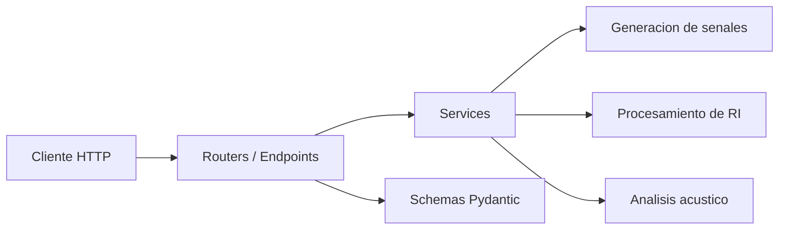

# Milestone 0: El Plano

**Fecha de entrega**: Semana 5 (28 de abril 2026)
**Peso en la nota**: 5%

## Objetivo

Planificar la arquitectura del software antes de escribir una sola linea de codigo. Este milestone busca que el grupo defina la estructura del proyecto, distribuya responsabilidades y establezca las bases para un desarrollo organizado y colaborativo.

Un buen plano es la diferencia entre un proyecto que se sostiene y uno que colapsa en la tercera entrega.

## Entregables

### 1. README.md del repositorio

El archivo `README.md` en la raiz del repositorio debe contener:

- **Nombre del proyecto** y descripcion breve (1-2 parrafos).
- **Integrantes del grupo** con nombre completo, legajo y rol asignado (por ejemplo: responsable de generacion de senales, responsable de procesamiento, responsable de testing/CI, responsable de documentacion).
- **Instrucciones de instalacion**: como clonar el repo, crear el entorno virtual y ejecutar el proyecto. Debe funcionar copiando y pegando los comandos.
- **Estructura del proyecto**: arbol de directorios con una breve explicacion de cada carpeta y archivo principal.

### 2. Diagrama de arquitectura

El diagrama debe realizarse en **Mermaid** (embebido en el README) o en **draw.io** (exportado a PNG e incluido en el README). Debe mostrar:

- **Capas del sistema**: routers (endpoints) → services (logica de negocio) → schemas (validacion).
- **Modulos principales** y sus responsabilidades (generacion, procesamiento, analisis).
- **Flujo de datos** entre capas: request HTTP → validacion Pydantic → servicio → respuesta.
- **Inputs y outputs del sistema completo**: desde el archivo de audio hasta los parametros acusticos calculados.
- **Dependencias externas** relevantes (fastapi, numpy, scipy, pydantic, etc.).

Ejemplo de estructura minima en Mermaid:



El diagrama debe reflejar **todos los modulos de M1, M2 y M3**.

### 3. GitHub Issues

Crear al menos **10 issues** en el repositorio de GitHub, cada uno con:

- **Titulo descriptivo**: por ejemplo, "Implementar generacion de ruido rosa con algoritmo Voss-McCartney".
- **Descripcion** con los requisitos funcionales y criterios de aceptacion.
- **Labels** que indiquen el milestone correspondiente: `milestone-1`, `milestone-2`, `milestone-3`.
- **Asignacion** a uno o mas integrantes del grupo.
- **Estimacion** de complejidad (opcional pero recomendado): usar labels como `complejidad-baja`, `complejidad-media`, `complejidad-alta`.

### 4. Estructura del repositorio

El repositorio debe tener la siguiente estructura minima funcional, orientada a una API REST con FastAPI:

```
rir-api/
├── pyproject.toml          # o requirements.txt
├── README.md
├── LICENSE
├── app/
│   ├── __init__.py
│   ├── main.py             # Punto de entrada FastAPI
│   ├── settings.py         # Configuracion (pydantic-settings)
│   ├── routers/
│   │   ├── __init__.py
│   │   └── health.py       # Endpoint /health (placeholder)
│   ├── schemas/
│   │   └── __init__.py
│   └── services/
│       └── __init__.py
├── tests/
│   └── test_placeholder.py
├── docs/
│   └── (vacio por ahora)
├── data/
│   └── .gitkeep
└── .github/
    └── workflows/
        └── ci.yml (opcional en M0)
```

**Requisitos especificos:**

- `pyproject.toml` (o `requirements.txt`) con dependencias minimas: fastapi, uvicorn, numpy, scipy, pydantic, sounddevice, matplotlib, y dependencias de desarrollo (pytest, httpx, ruff).
- `app/main.py` con una aplicacion FastAPI minima que responda en `/` y `/health`.
- `tests/test_placeholder.py` con al menos un test que pase (puede ser trivial).
- El proyecto debe poder ejecutarse con `uvicorn app.main:app --reload` o `python -m app.main`.

> **Referencia**: Explorar la [documentacion interactiva de la API de la catedra](https://rir-api.onrender.com/docs) para entender la estructura de una API REST con FastAPI.

**Branching strategy documentada** (en el README o en un archivo `CONTRIBUTING.md`):

- Rama `main` protegida (solo merge via pull request).
- Ramas de feature con convencion de nombres: `feature/nombre-descriptivo`.
- Convencion de commits (recomendado: [Conventional Commits](https://www.conventionalcommits.org/)).

## Criterios de aprobacion

- [ ] Repositorio accesible por los docentes (agregar como colaboradores)
- [ ] README completo, claro y con instrucciones que funcionan
- [ ] Diagrama de arquitectura que muestre todos los modulos de M1, M2 y M3
- [ ] Al menos 10 issues creados con labels y asignaciones
- [ ] Estructura de proyecto funcional: se puede ejecutar con `uvicorn app.main:app --reload`
- [ ] Endpoint `/health` responde correctamente
- [ ] Al menos un test que pase con `pytest`
- [ ] Branching strategy documentada

## Recursos recomendados

- [API de referencia de la catedra (Swagger UI)](https://rir-api.onrender.com/docs)
- [FastAPI: documentacion oficial](https://fastapi.tiangolo.com/)
- [Pydantic: validacion de datos](https://docs.pydantic.dev/)
- [uv: gestor de paquetes rapido para Python](https://docs.astral.sh/uv/)
- [Conventional Commits](https://www.conventionalcommits.org/)
- [Mermaid: diagramas en Markdown](https://mermaid.js.org/)
- [GitHub Issues: buenas practicas](https://docs.github.com/en/issues)
